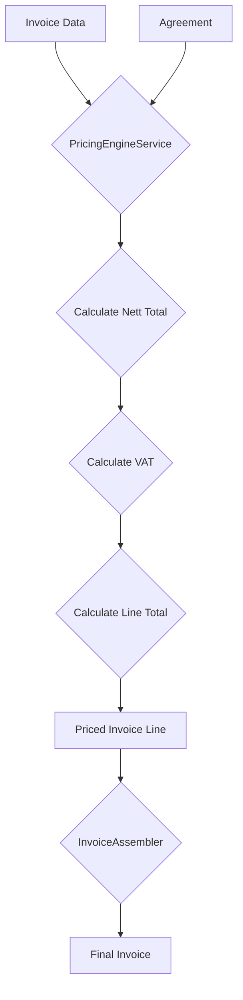

# Agreement-Based Pricing Logic

This document explains how the pricing logic works within the invoicing engine, based on customer agreements.

## Overview

The pricing engine calculates the final price for each line item on an invoice by applying a set of rules defined in a customer's agreement. This process involves calculating a nett total, applying VAT, and then summing these to get the final line total.

## Key Components

- **`AgreementService`**: This service is responsible for retrieving the correct agreement for a given customer. The agreement contains all the rules needed to price an invoice line.
- **`PricingEngineService`**: This service contains the core logic for calculating the price of an invoice line based on the rules from the agreement.

## Pricing Flow

The pricing logic follows these steps:

1.  **Retrieve Agreement**: The system first retrieves the customer's agreement using the `AgreementService`.
2.  **Price Each Line**: For each line in the invoice data, the `PricingEngineService` performs the following calculations:
    
    a.  **Calculate Base Charge**: It identifies the base charge for the line item using the `base_charge_column` specified in the agreement rules.
    
    b.  **Calculate Surcharges**: It sums up all the surcharges for the line item. Surcharges are identified by a `surcharge_prefix` and `surcharge_suffix` defined in the agreement rules (e.g., columns starting with `XC` and ending with `_charge`).
    
    c.  **Apply Multiplier**: The sum of the base charge and surcharges is then multiplied by a `multiplier` from the agreement. This allows for applying a customer-specific markup or discount.
        
        ```
        nett_total = (base_charge + surcharge_total) * multiplier
        ```
    
    d.  **Calculate VAT**: The VAT is calculated by applying the `vat_rate` from the agreement to the `nett_total`.
        
        ```
        vat_amount = nett_total * vat_rate
        ```
    
    e.  **Calculate Line Total**: The final line total is the sum of the `nett_total` and the `vat_amount`.
        
        ```
        line_total = nett_total + vat_amount
        ```

3.  **Assemble Invoice**: Once all lines are priced, the `InvoiceAssembler` service gathers all the priced lines and calculates the total amount for the invoice.

## Agreement Structure

An agreement is a simple data structure (typically an array) that contains the following information:

-   `version`: The version of the agreement.
-   `multiplier`: A numeric value to be applied to the sum of the base charge and surcharges.
-   `vat_rate`: The VAT rate to be applied (e.g., `0.21` for 21%).
-   `currency`: The currency for the invoice (e.g., `EUR`).
-   `rules`: An array of rules for parsing the invoice data, including:
    -   `base_charge_column`: The name of the column containing the base charge.
    -   `surcharge_prefix`: The prefix for columns that contain surcharges.
    -   `surcharge_suffix`: The suffix for columns that contain surcharges.

## Visualization

