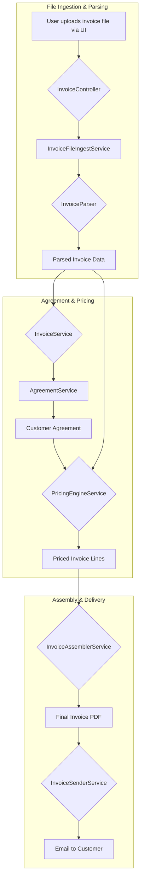

# Agreement Service and Architecture

This document outlines the architecture of the Agreement Service, its integration with the testing suite, and other relevant changes.

## Agreement Service

The `AgreementService` is responsible for managing customer agreements, which are now versioned. It retrieves agreement details from the database, which are then used by the `PricingEngine` to calculate invoice line items.

### Versioning

To support versioning, the `agreements` table has been modified:

- The unique constraint on `customer_id` has been removed.
- A `valid_from` timestamp has been added to track when a version becomes active.
- A new unique constraint has been added to the combination of `customer_id` and `version`.

The `AgreementService` has been updated to handle this new structure:

- `getAgreementForCustomer()`: Fetches the latest agreement version for a customer based on the `valid_from` timestamp. If no customer-specific agreement is found, it falls back to a standard agreement with `customer_id` = `standard`.
- `createNewVersion(string $customerId, array $data)`: Creates a new agreement version for a customer, incrementing the version number and setting the `valid_from` timestamp.

### Service Provider

The `AgreementService` uses a dedicated service provider, `AgreementServiceProvider`, to register itself with the Laravel application and to load its database migrations. The provider's `boot` method contains the following logic:

```php
public function boot(): void
{
    $this->loadMigrationsFrom(__DIR__.'/../../database/migrations');
}
```

This ensures that the `agreements` table is created when running the application's migrations.

## Testing

Significant refactoring was done to ensure the test suite is robust and reliable. The key changes are:

1.  **Database Migrations**: The tests now use the `RefreshDatabase` trait, which ensures that the database is migrated before each test, providing a clean and predictable state.

2.  **Service Container**: Services are no longer instantiated manually in tests. Instead, they are resolved from Laravel's service container using `$this->app->make()`. This ensures that all dependencies are correctly injected and that the services are in a valid state.

3.  **Agreement Fallback Testing**: The test suite verifies that the service always returns a valid agreement:
    - `it_can_get_agreement_for_a_customer()`: Verifies retrieval of customer-specific agreements
    - `it_falls_back_to_standard_agreement()`: Ensures fallback to standard agreement when no customer-specific agreement exists
    - `it_returns_latest_valid_agreement_version()`: Validates version selection based on `valid_from` timestamp

4.  **Data Seeding**: Tests that rely on database records now use the `AgreementService` to create versioned agreements. For example, the `ApplyPricingTest` creates an agreement before dispatching the event that triggers the pricing logic:

    ```php
    $agreementService = $this->app->make(AgreementService::class);
    $agreementService->createNewVersion('some_customer_id', [
        'strategy' => 'standard',
        'multiplier' => 1.0,
        'vat_rate' => 21.0,
        'currency' => 'EUR',
        'language' => 'en',
        'rules' => [
            'base_charge_column' => 'Weight Charge',
            'surcharge_prefix' => 'SUR',
            'surcharge_suffix' => 'CHARGE',
        ],
    ]);
    ```

## End-to-End Invoicing Flow

The following diagram and steps describe the complete invoicing process, from file upload to final delivery.



### Detailed Steps

1.  **File Upload**: The process begins when a user uploads an invoice file (e.g., an Excel spreadsheet) through the web interface. The `InvoiceController` receives the file and passes it to the `InvoiceFileIngestService`.

2.  **Ingestion and Parsing**: The `InvoiceFileIngestService` saves the file and uses an `InvoiceParser` to read its contents. The parser extracts the raw data from each line of the invoice and determines the customer ID.

3.  **Agreement Retrieval**: The `InvoiceService` takes the parsed data and uses the `AgreementService` to find the correct, active agreement for the customer. The `AgreementService` queries the database for the latest version of the agreement based on the `valid_from` date. If no customer-specific agreement is found, it falls back to the standard agreement.

4.  **Pricing Calculation**: With the agreement and invoice data in hand, the `PricingEngineService` is called. It uses a factory to select the appropriate pricing strategy (e.g., `StandardPricingStrategy`) as defined in the agreement. The strategy then calculates the final price for each line item, including any surcharges and VAT.

5.  **Invoice Assembly**: The `InvoiceAssemblerService` takes the priced line items and compiles them into a structured format. It then uses the `PdfRenderer` to generate a professional-looking PDF of the invoice with locale-based formatting.

6.  **Locale-Based Formatting**: The `PdfRenderer` uses the agreement's `language` and `currency` fields to apply appropriate locale-specific formatting through the `FormattingService`. This ensures numbers, currencies, and other data are displayed according to regional preferences.

7.  **Delivery**: Finally, the `InvoiceSenderService` sends the generated PDF to the customer via email, completing the invoicing cycle.

## SFTP Integration

There is currently no direct integration with an SFTP server in the codebase. The file ingestion process is handled locally from the `storage/temp_invoices` directory.

## Locale-Based Formatting Integration

The Agreement Service now supports locale-based formatting for PDF generation:

### New Agreement Fields

-   `language`: Specifies the locale for number and currency formatting (e.g., 'de' for German, 'en' for English)
-   `currency`: Used both for pricing calculations and locale-specific currency formatting

### PDF Rendering Integration

The `PdfRenderer` service now:
-   Accepts an optional `Agreement` object in its `render` method
-   Uses the agreement's `language` and `currency` fields for locale-aware formatting
-   Integrates with the `FormattingService` to apply regional formatting rules
-   Maintains backward compatibility when no agreement is provided

### Supported Locales

-   **German (de)**: Comma decimal separator, period thousands separator
-   **English (en)**: Period decimal separator, comma thousands separator  
-   **French (fr)**: Comma decimal separator, space thousands separator
-   **Fallback**: Defaults to English formatting for unsupported locales

## Summary of Changes

-   Created `AgreementServiceProvider` and `InvoiceServiceProvider` to automatically load package migrations.
-   Registered the new service providers in `bootstrap/providers.php`.
-   Refactored all tests in the `PricingEngine` package to use `RefreshDatabase` and the service container.
-   Seeded an agreement in `ApplyPricingTest` to resolve a `TypeError`.
-   Removed temporary migration-loading logic from `tests/TestCase.php`.
-   **NEW**: Integrated locale-based formatting system with Agreement Service and PDF rendering.
-   **NEW**: Enhanced `PdfRenderer` to support Agreement-based locale formatting.
-   **NEW**: Added comprehensive test coverage for locale-specific PDF generation.