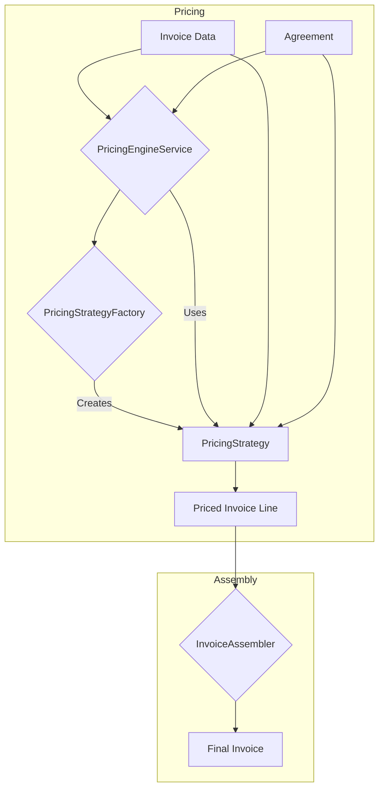

# Agreement-Based Pricing Logic

This document explains how the pricing logic works within the invoicing engine, based on customer agreements.

## Overview

The pricing engine calculates the final price for each line item on an invoice by applying a set of rules defined in a customer's agreement. This process involves calculating a nett total, applying VAT, and then summing these to get the final line total.

## Key Components

- **[`AgreementService`](./packages/AgreementService/src/Services/AgreementService.php)**: This service is responsible for retrieving the correct agreement for a given customer. The agreement contains all the rules needed to price an invoice line.
- **[`PricingEngineService`](./packages/PricingEngine/src/Services/PricingEngineService.php)**: This service orchestrates the pricing process. It uses a factory to select the appropriate pricing strategy based on the customer's agreement and then delegates the calculation to that strategy.
- **[`PricingStrategyInterface`](./packages/PricingEngine/src/Strategies/PricingStrategyInterface.php)**: This interface defines a common contract for all pricing strategies, ensuring that new strategies can be seamlessly integrated into the system.
- **[`StandardPricingStrategy`](./packages/PricingEngine/src/Strategies/StandardPricingStrategy.php)**: This is the default pricing strategy. It calculates the price by taking a base charge and adding any surcharges, then multiplying the total by a specific value. Think of it as a simple, flat-rate calculation with a markup.
- **[`TieredPricingStrategy`](./packages/PricingEngine/src/Strategies/TieredPricingStrategy.php)**: This strategy applies different rates based on the quantity of an item. For example, the first 10 items might be charged at one rate, the next 20 at a lower rate, and so on. It's designed for bulk discounts.
- **[`VolumeAndDistanceStrategy`](./packages/PricingEngine/src/Strategies/VolumeAndDistanceStrategy.php)**: This strategy is used when the price depends on both the size (volume) of an item and how far it needs to go (distance). It calculates a total price by adding a base fee to charges for volume and distance. This is common in logistics and shipping.
- **[`PricingStrategyFactory`](./packages/PricingEngine/src/Services/PricingStrategyFactory.php)**: This factory is responsible for creating an instance of the correct pricing strategy based on the `strategy` specified in the customer's agreement.

## Pricing Flow

The pricing logic follows these steps:

1.  **Retrieve Agreement**: The system first retrieves the customer's agreement using the [`AgreementService`](./packages/AgreementService/src/Services/AgreementService.php).
2.  **Select Strategy**: The [`PricingEngineService`](./packages/PricingEngine/src/Services/PricingEngineService.php) uses the [`PricingStrategyFactory`](./packages/PricingEngine/src/Services/PricingStrategyFactory.php) to create the appropriate pricing strategy based on the `strategy` field in the agreement.
3.  **Price Each Line**: For each line in the invoice data, the selected strategy's `calculate` method is called to determine the final price.
4.  **Assemble Invoice**: Once all lines are priced, the [`InvoiceAssembler`](./packages/InvoiceAssembler/src/Services/InvoiceAssemblerService.php) service gathers all the priced lines and calculates the total amount for the invoice.

## Agreement Structure

An agreement is a simple data structure (typically an array) that contains the following information:

-   `version`: The version of the agreement.
-   `strategy`: The identifier for the pricing strategy to use (e.g., `standard`, `tiered`, `volume_and_distance`).
-   `multiplier`: A numeric value used by the pricing strategy.
-   `vat_rate`: The VAT rate to be applied (e.g., `0.21` for 21%).
-   `currency`: The currency for the invoice (e.g., `EUR`).
-   `rules`: An array of rules specific to the pricing strategy. The contents of this array depend on the selected strategy:
    -   For the `standard` strategy:
        -   `base_charge_column`: The name of the column containing the base charge.
        -   `surcharge_prefix`: The prefix for columns that contain surcharges.
        -   `surcharge_suffix`: The suffix for columns that contain surcharges.
    -   For the `tiered` strategy:
        -   `quantity_column`: The name of the column containing the quantity.
        -   `tiers`: An array of pricing tiers, where each tier has an `up_to` quantity and a `rate`.
    -   For the `volume_and_distance` strategy:
        -   `volume_column`: The name of the column containing the volume.
        -   `distance_column`: The name of the column containing the distance.
        -   `base_rate`: A flat base rate for the service.
        -   `volume_rate`: The rate to charge per unit of volume.
        -   `distance_rate`: The rate to charge per unit of distance.

## Visualization

